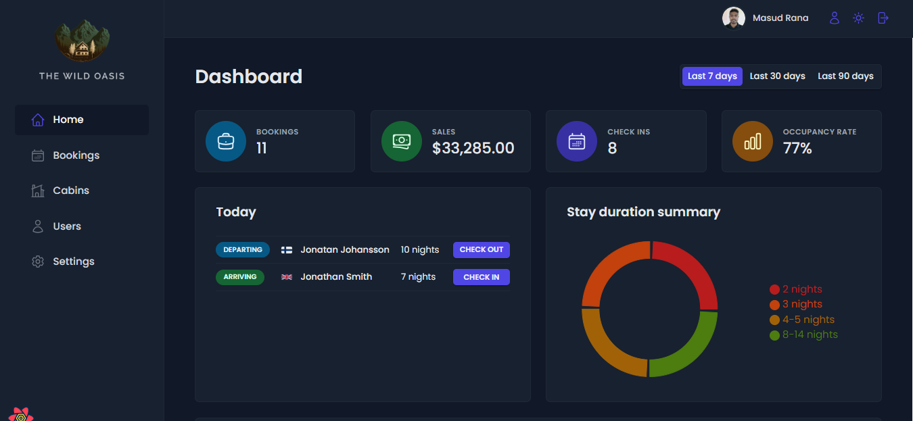
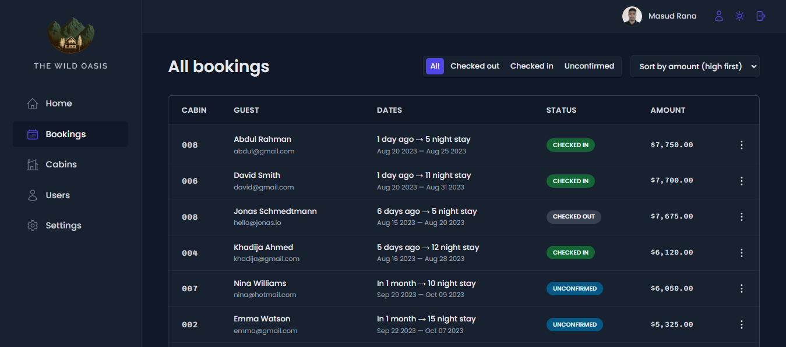
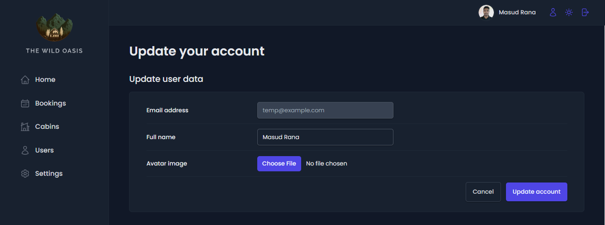

<h1 align="center">
The Wild Oasis - Stay, Book, Relax</h1>

<p align="center"></p>

<p>Welcome to The Wild Oasis Hotel Management Application documentation. This application is designed to manage hotel operations, including sales statistics, cabin management, user management, booking management, and various customization options. It integrates authentication, database storage, and dark mode features.</p>

## 🚀 Live Demo

[https://the-wild-oasis-phi.vercel.app/](https://the-wild-oasis-phi.vercel.app/)

## 🎮 Demo Account

You can access our application using the following demo account:

- **Email**: temp@example.com
- **Password**: test1234

## 🛠️ Installation Steps:

<p>1. Clone the repository</p>

```
git clone https://github.com/masud-rana44/The-Wild-Oasis.git
```

<p>2. Install the required dependencies </p>

```
npm install
```

<p>3. Start the development server</p>

```
npm run dev
```

<p>4. Access the application at</p>

```
http://localhost:5173
```

## 📝 Features

1. **Sales Statistics**: Visualize revenue trends and occupancy rates with interactive charts.

2. **Cabin Management**: Easily sell, edit, and delete cabins, and track availability.

3. **User Management**: Manage user accounts and grant access to hotel staff.

4. **Booking Management**: Efficiently handle reservations, check-in, and check-out details.

5. **Settings Customization**: Personalize language, notifications, and display preferences.

6. **Authentication and Security**: Secure access with Supabase Auth, ensuring data privacy.

7. **Dark Mode Support**: Offer a comfortable viewing experience with dark mode.

8. **Database Integration**: Utilize Supabase for reliable data storage and retrieval.

### screenshots




## 💻 Technology Used

The Wild Oasis Hotel Management Application is built using the following technologies and libraries:

- **React**: JavaScript library for UI development.

- **Supabase**: Cloud database service for real-time and secure data storage.

- **@tanstack/react-query**: Data-fetching and state management library for React.

- **date-fns**: JavaScript date utility library for parsing, formatting, and manipulating dates.

- **react-router-dom**: Library for routing and navigation in React apps.

- **recharts**: Composable charting library for React.

- **styled-components**: CSS-in-JS library for styling React components.

- **react-hot-toast**: Customizable toast notification library for React.

- **react-icons**: Collection of customizable icons for React apps.

- **react-hook-form**: Library for form state management and validation in React.

<h3>💖Like my work?</h3>

This project needs a ⭐️ from you. Don't forget to leave a star ⭐️.
